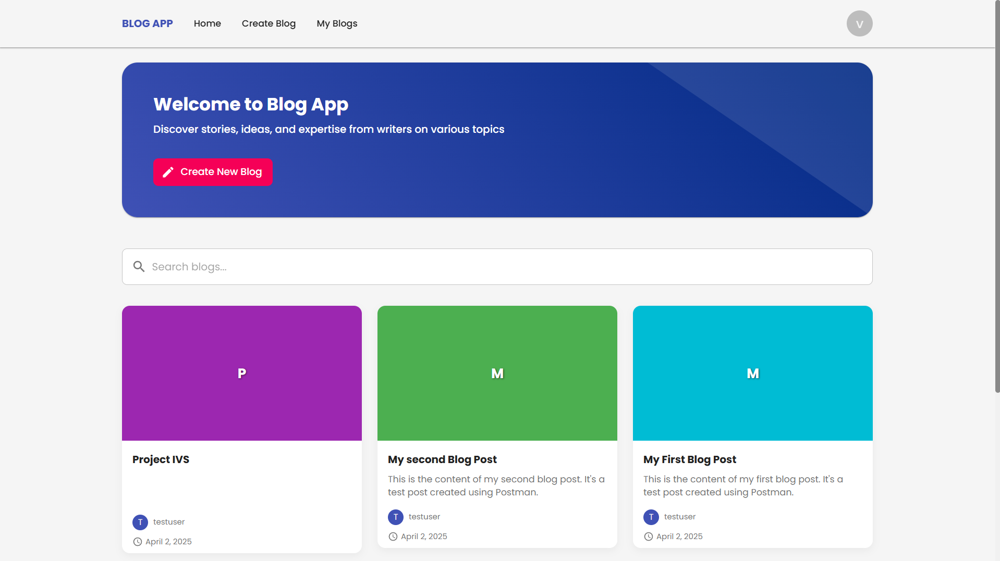
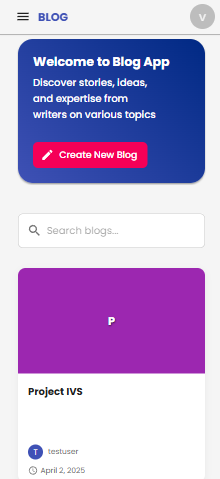
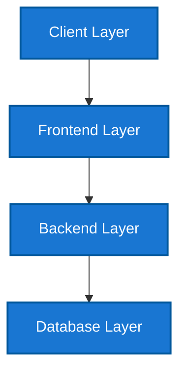
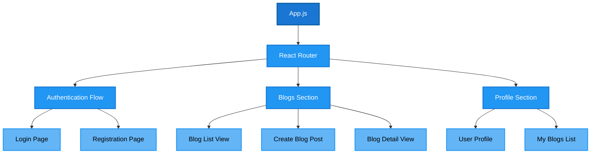
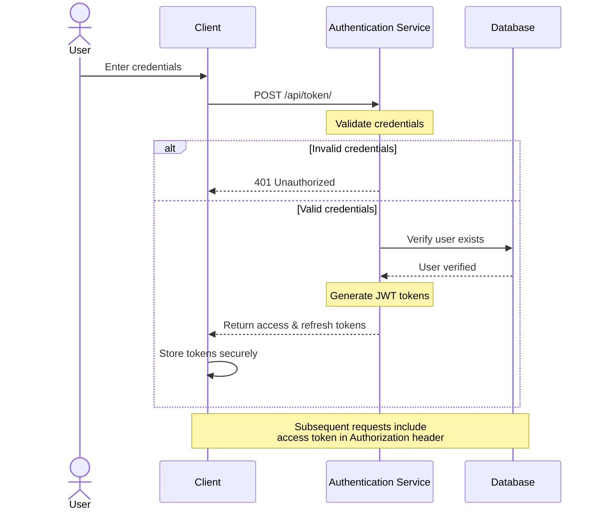

# Blog Application 📄

A full-stack blog platform that enables users to create, read, update, and delete blog posts with a modern, responsive UI.

**Developed by:** pranaykumar2  
**Last Updated:** April 2, 2025






## Table of Contents

- [Overview](#overview)
- [Features](#features)
- [Tech Stack](#tech-stack)
- [Architecture](#architecture)
- [Setup Instructions](#setup-instructions)
    - [Backend Setup](#backend-setup)
    - [Frontend Setup](#frontend-setup)
- [API Documentation](#api-documentation)
- [Usage Guide](#usage-guide)
- [Contributing](#contributing)
- [License](#license)

## Overview

This full-stack blog application allows users to create accounts, publish blog posts, and interact with content from other users. Built with Django REST Framework for the backend and React with Material UI for the frontend, it demonstrates modern web development practices with a focus on user experience and performance.

## Features

### User Management
- User registration and authentication
- JWT-based authentication
- Profile management
- Authorization controls for content

### Blog Management
- Create, read, update, and delete blog posts
- Rich text editing with image support
- Blog listing with search and pagination
- Personal blog management

### UI/UX
- Responsive design for mobile and desktop
- Material Design aesthetics
- Smooth animations and transitions
- Dark mode support
- Interactive components (modals, alerts, confirmations)

## Tech Stack

### Backend
- **Framework**: Django 4.2
- **API**: Django REST Framework
- **Authentication**: JWT (JSON Web Tokens)
- **Database**: SQLite (development) / PostgreSQL (production)
- **Media Storage**: Local FileSystem

### Frontend
- **Framework**: React 18
- **State Management**: React Context API
- **UI Library**: Material UI 5
- **Form Management**: Formik with Yup validation
- **Routing**: React Router v6
- **HTTP Client**: Axios
- **Animations**: Framer Motion
- **Editor**: React Quill

## Architecture

The application follows a client-server architecture with clear separation of concerns:



### Component Structure

The frontend is organized into modular components with distinct responsibilities:



## Setup Instructions

### Backend Setup

1. **Clone the repository**:
   ```bash
   git clone https://github.com/pranaykumar2/private-blog.git
   cd private-blog/backend
   ```

2. **Set up a virtual environment**:
   ```bash
   python -m venv venv
   source venv/bin/activate  # On Windows: venv\Scripts\activate
   ```

3. **Install dependencies**:
   ```bash
   pip install -r requirements.txt
   ```

4. **Apply migrations**:
   ```bash
   python manage.py migrate
   ```

5. **Create a superuser**:
   ```bash
   python manage.py createsuperuser
   ```

6. **Run the development server**:
   ```bash
   python manage.py runserver
   ```
   The Django backend will now be running at http://localhost:8000/

### Frontend Setup

1. **Navigate to the frontend directory**:
   ```bash
   cd ../frontend
   ```

2. **Install dependencies**:
   ```bash
   npm install
   ```

3. **Start the development server**:
   ```bash
   npm start
   ```
   The React frontend will now be running at http://localhost:3000/

## API Documentation

### Authentication Flow



### API Endpoints

#### Authentication Endpoints

| Method | Endpoint | Description |
| --- | --- | --- |
| POST | `/api/users/register/` | Register a new user |
| POST | `/api/token/` | Obtain JWT token |
| POST | `/api/token/refresh/` | Refresh JWT token |
| GET | `/api/users/profile/` | Get current user profile |

#### Blog Endpoints

| Method | Endpoint | Description |
| --- | --- | --- |
| GET | `/api/blogs/` | List all blogs with pagination |
| GET | `/api/blogs/:id/` | Get blog detail |
| POST | `/api/blogs/create/` | Create a new blog |
| PUT | `/api/blogs/:id/` | Update a blog |
| DELETE | `/api/blogs/:id/` | Delete a blog |
| GET | `/api/blogs/my-blogs/` | List user's blogs |

## Usage Guide

### Registration and Login

1. Navigate to the registration page by clicking "Sign Up" on the login page
2. Complete the three-step registration process
3. After registration, you'll be automatically logged in
4. For future logins, use the login page with your username and password

### Creating a Blog Post

1. Click "Create New Blog" on the home page or navigation bar
2. Enter a title for your blog post
3. Use the rich text editor to create your content
    - Format text using the toolbar options
    - Insert images using the image button
4. Click "Publish" to post your blog

### Managing Your Blogs

1. Navigate to "My Blogs" in the navigation menu
2. View a list of all blogs you've created
3. Use the menu (three dots) on each blog card to:
    - Edit the blog
    - Delete the blog

### Reading and Discovering Blogs

1. Browse all blogs on the home page
2. Use the search bar to find blogs by title or content
3. Click on any blog card to read the full blog
4. Navigate through pages using the pagination controls

## Contributing

Contributions are welcome! Please feel free to submit a Pull Request.

1. Fork the repository
2. Create your feature branch (`git checkout -b feature/amazing-feature`)
3. Commit your changes (`git commit -m 'Add some amazing feature'`)
4. Push to the branch (`git push origin feature/amazing-feature`)
5. Open a Pull Request

## License

This project is licensed under the MIT License - see the LICENSE file for details.

---

© 2025 Blog Application. All rights reserved.
